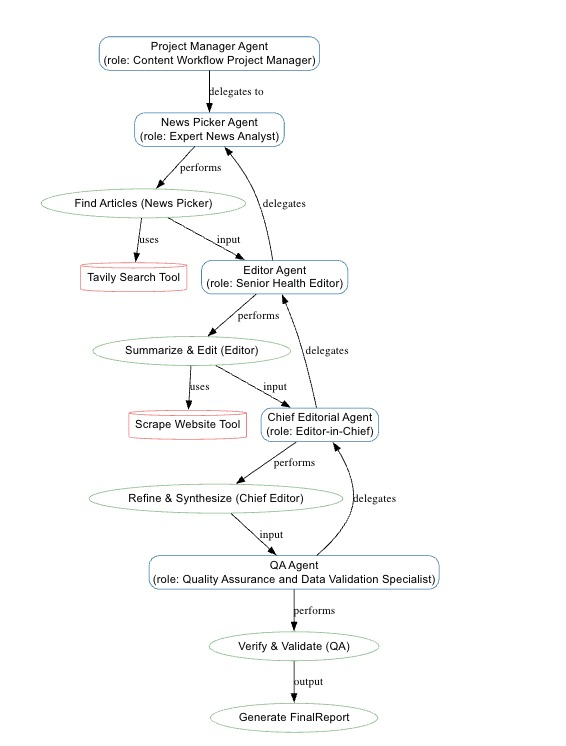

# HealthNewsPortal Crew

Welcome to the HealthNewsPortal Crew project, powered by [crewAI](https://crewai.com). This template is designed to help you set up a multi-agent AI system with ease, leveraging the powerful and flexible framework provided by crewAI. Our goal is to enable your agents to collaborate effectively on complex tasks, maximizing their collective intelligence and capabilities.

## Installation

Ensure you have Python >=3.10 <3.14 installed on your system. This project uses [UV](https://docs.astral.sh/uv/) for dependency management and package handling, offering a seamless setup and execution experience.

First, if you haven't already, install uv:

```bash
pip install uv
```

Next, navigate to your project directory and install the dependencies:

(Optional) Lock the dependencies and install them by using the CLI command:
```bash
crewai install
```
### Customizing

**Add your `OPENAI_API_KEY` into the `.env` file**

- Modify `src/health_news_portal/config/agents.yaml` to define your agents
- Modify `src/health_news_portal/config/tasks.yaml` to define your tasks
- Modify `src/health_news_portal/crew.py` to add your own logic, tools and specific args
- Modify `src/health_news_portal/main.py` to add custom inputs for your agents and tasks

## Running the Project

To kickstart your crew of AI agents and begin task execution, run this from the root folder of your project:

```bash
$ crewai run
```

This command initializes the health-news-portal Crew, assembling the agents and assigning them tasks as defined in your configuration.

This example, unmodified, will run the create a `report.md` file with the output of a research on LLMs in the root folder.

## Understanding Your Crew

The health-news-portal Crew is composed of multiple AI agents, each with unique roles, goals, and tools. These agents collaborate on a series of tasks, defined in `config/tasks.yaml`, leveraging their collective skills to achieve complex objectives. The `config/agents.yaml` file outlines the capabilities and configurations of each agent in your crew.

## Support

For support, questions, or feedback regarding the HealthNewsPortal Crew or crewAI.
- Visit our [documentation](https://docs.crewai.com)
- Reach out to us through our [GitHub repository](https://github.com/joaomdmoura/crewai)
- [Join our Discord](https://discord.com/invite/X4JWnZnxPb)
- [Chat with our docs](https://chatg.pt/DWjSBZn)

Let's create wonders together with the power and simplicity of crewAI.

## Prompts

As an experienced crewAI orchestrator, which as a through understanding of crewAI architecture and code structure as mentioned in https://docs.crewai.com/en/introduction. Can you build agents, tasks and crew and the relevant yaml file to support a use case as mentioned below, 

"We will have a Main topic ( ‘Cancer Health Care’ ) and 5 subtopics predefined in a file as listed below..

1.⁠ ⁠Cancer Research & Prevention – 
How is AI transforming cancer research by analyzing large-scale genomic, imaging, and clinical datasets to discover new insights? In what ways can AI predict cancer risk and guide prevention strategies at both individual and population levels?
2.⁠ ⁠Early Detection and Diagnosis – 
How does AI enhance early cancer detection and diagnosis through imaging, pathology, and screening tools?
3.⁠ ⁠Cancer Drug Discovery and Development – 
What role does AI play in accelerating cancer drug discovery, from target identification to clinical trials?
4.⁠ ⁠Cancer Treatment Methods – 
How can AI assist in determining whether a cancer patient requires chemotherapy, and if so, recommend the most suitable medication and regimen during the chemotherapy process?
5.⁠ ⁠Precision Oncology – 
How does AI enable precision oncology by personalizing treatments through integration of genomics, medical records, and patient data?

For each sub-topic ask another agent (news-picker-agent) to google for 5 News articles.

Another agent (editor-agent), will research the news article picked up by news-picker-agent, and do the following:
1. Create a summary of the news article.
2. Find at least 5 relevant news articles with a brief description for each. refine the search to collect at least 5 relevat articles 
   by refine the search terma little without chnaging the the sub topic context etc. 
3. Create an editorial based on the 5 news articles for each sub-topic.


Another agent (chief-editorial-agent), will do the following:
1. Pick the best news article to be displayed on the home page.
2. Review the editorials for each sub-topic and work with the editor-agent to refine it.
3. Create a main editorial based on 5 sub-topic editorial.

Another agent (qa-agent), will do the following:
1. Verify if 5 news article are picked-up correctly
2. Verify if links associated with each news article looks good.
3. Verify if sub-topic editorial and main editorial is present.
4. If anything of the above is not good, then work with other agents to make sure they are looking good."

Here we need to build 4 agents and mentioned below. Role of these agents are mentioned above,

1. news picker agent
2. Editor Agent
3. chief-editorial-agent
5. qa-agent

Editor agent will have access to the TavilySearchTool tool to complete the web search. It need sot make sure to collect at the least 5 articles for each sub topic.

# Response # 
The output response will be a JSON structure enforced with **pydantic** model and will be verified by the QA agent. 

{
  "main_topic": {
    "title": "string",
    "editorial": "string",       //main topic editorial.
    "articles": [
      {
        "sub_topic": "string",    //Sub-topic name 
        "headline": "string",     //New article headline
        "url": "string",
        "source": null,
        "summary": null,          //source of the article
        "relevance_score": 0.0
      }
    ]
  },
  "sub_topics": [
    {
      "sub_topic": {
        "title": "string",       //Sub_topic name 
        "editorial": "string"    //sub_topic editorial
      },
      "articles": [
        {
          "headline": "string",  //New article headline
          "url": "string",
          "source": null,
          "summary": null,
          "relevance_score": 0.0
        }
      ]
    }
  ]
}

# Gaurdrails #
1. You should not make up news article or generate news on your own
2. In the event of Tool failures we should retry once and if it is again not successful, then we should gracefully quite with approporiate message.

## Graphviz Flow

```JSON
digraph health_news_portal {
    rankdir="TB" // Top-to-bottom layout

    // --- Node definitions ---
    node [shape=box, style=rounded, color=SteelBlue, fontname="Arial"];
    "Project Manager Agent" [label="Project Manager Agent\n(role: Content Workflow Project Manager)"];
    "News Picker Agent" [label="News Picker Agent\n(role: Expert News Analyst)"];
    "Editor Agent" [label="Editor Agent\n(role: Senior Health Editor)"];
    "Chief Editorial Agent" [label="Chief Editorial Agent\n(role: Editor-in-Chief)"];
    "QA Agent" [label="QA Agent\n(role: Quality Assurance and Data Validation Specialist)"];

    node [shape=oval, color=DarkSeaGreen, fontname="Arial"];
    "Find Articles" [label="Find Articles (News Picker)"];
    "Summarize & Edit" [label="Summarize & Edit (Editor)"];
    "Refine & Synthesize" [label="Refine & Synthesize (Chief Editor)"];
    "Verify & Validate" [label="Verify & Validate (QA)"];
    "Generate FinalReport" [label="Generate FinalReport"];

    node [shape=cylinder, color=LightCoral, fontname="Arial"];
    "Tavily Search Tool" [label="Tavily Search Tool"];
    "Scrape Website Tool" [label="Scrape Website Tool"];

    // --- Edge definitions ---
    // Agent -> Task
    "Project Manager Agent" -> "News Picker Agent" [label="delegates to"];
    "Project Manager Agent" -> "Editor Agent" [label="delegates to"];

    "News Picker Agent" -> "Find Articles" [label="performs"];
    "Editor Agent" -> "Summarize & Edit" [label="performs"];
    "Chief Editorial Agent" -> "Refine & Synthesize" [label="performs"];
    "QA Agent" -> "Verify & Validate" [label="performs"];

    // Task -> Task (Sequential Flow)
    "Find Articles" -> "Summarize & Edit" [label="input"];
    "Summarize & Edit" -> "Chief Editorial Agent" [label="input"];
    "Refine & Synthesize" -> "QA Agent" [label="input"];
    "Verify & Validate" -> "Generate FinalReport" [label="output"];

    // Task -> Tool
    "Find Articles" -> "Tavily Search Tool" [label="uses"];
    "Summarize & Edit" -> "Scrape Website Tool" [label="uses"];
}
```
